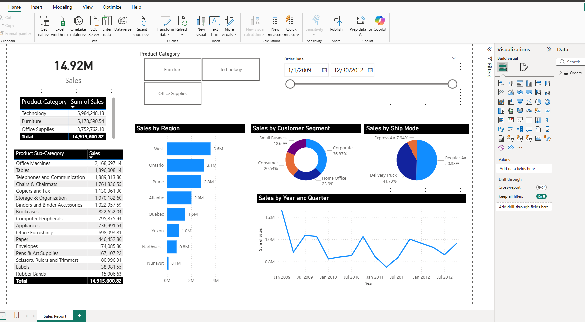

# Superstore Sales Dashboard (Power BI)

## Project Overview
This project presents an interactive Power BI dashboard built using the Superstore dataset from Kaggle. The goal is to analyze sales, customer behavior, and key business insights.

## Dataset
- Source: Kaggle Superstore Dataset
- Format: Excel

## Data Transformation (Power Query)
- Converted **Order Date** from text to Date format (English UK)
- Created **Year** and **Month** columns from Order Date
- Split **Customer Name** into First Name and Last Name
- Changed Order Date to **Short Date** format
- Removed summarization in columns: Order ID, Product Base Margin, Year

## Dashboard Features
1. Key Metrics & Summaries
- Total Sales KPI: A high-level card displaying total revenue of 14.92M.
- Product Category Table: A summary table showing sales distribution across Technology, Furniture, and Office Supplies.
- Sub-Category Detail: A granular table ranking performance for 17+ specific categories.
2. Interactive Filtering
- Product Category Slicer: Tile-style buttons for quick filtering by department.
- Temporal Range Slicer: A dual-point slider for filtering data between 2009 and 2012.
3. Data Visualizations
- Regional Performance (Bar Chart): A horizontal ranking of sales by territory (e.g., West, Ontario, Prairie).
- Customer Segmentation (Donut Chart): A breakdown of the user base, dominated by the Corporate segment at 36.87%.
- Logistics Analysis (Pie Chart): Visualizes shipping preferences, showing Regular Air as the primary mode (50.33%).
- Time-Series Trend (Line Chart): Tracks sales fluctuations by Year and Quarter to identify seasonal peaks and troughs.
4. Visual Design
- Unified Theme: High-contrast headers with a minimalist grid layout.
- Direct Labeling: All charts include data labels for immediate insights without requiring tooltips.

## Preview

## Tools Used
- Power BI Desktop
- Power Query Editor
- Microsoft Excel

## Author
> **Developed by: Andy Razon**
